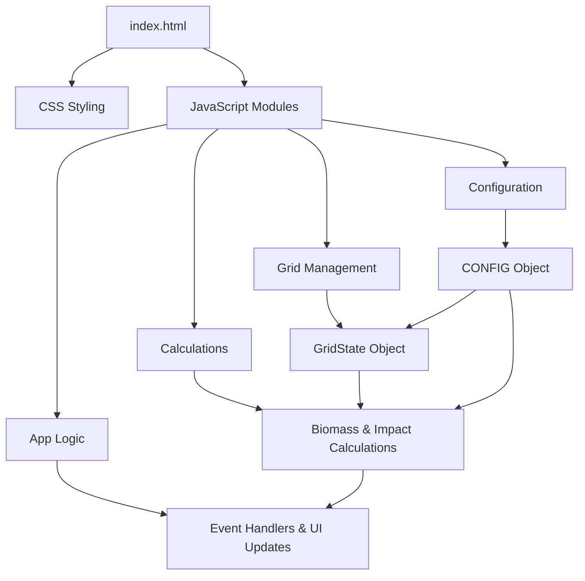
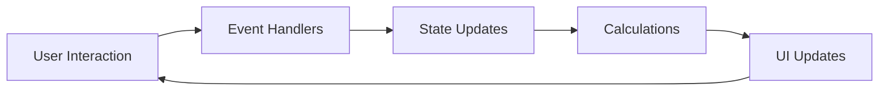

# System Patterns: Marine Reserve Impact Evaluation App

## Architecture Overview

The Marine Reserve Impact Evaluation App follows a modular, component-based architecture that separates concerns and promotes maintainability. The application is structured as a client-side web application with no server dependencies, making it suitable for deployment on GitHub Pages.



## Key Design Patterns

### Module Pattern
The application uses JavaScript modules to encapsulate functionality and maintain separation of concerns:

- **config.js**: Contains all configurable parameters
- **utils.js**: Provides utility functions used across the application
- **calculations.js**: Handles biomass and impact calculations
- **grid.js**: Manages grid state and rendering
- **app.js**: Coordinates application flow and event handling

### Object Literal Pattern
The `GridState` object serves as a central state manager for the grid, encapsulating both data and behavior:

```javascript
const GridState = {
    // Data properties
    cells: [],
    selectedCells: [],
    maxSelections: CONFIG.DEFAULT_SURVEY_SITES,
    
    // Methods
    initialize() { /* ... */ },
    render() { /* ... */ },
    toggleCellSelection(cell) { /* ... */ },
    // ...
};
```

This pattern provides a clean interface for grid operations while keeping related functionality together.

### Observer Pattern (Event-Driven)
The application uses DOM event listeners to respond to user interactions:

```javascript
// Button click events
calculateButton.addEventListener('click', () => { /* ... */ });
resetButton.addEventListener('click', () => { /* ... */ });
newScenarioButton.addEventListener('click', () => { /* ... */ });

// Input change events
siteCountInput.addEventListener('change', () => { /* ... */ });

// Cell click events (dynamically added)
cellElement.addEventListener('click', () => this.toggleCellSelection(cell));
```

This event-driven approach decouples UI interactions from business logic.

## Data Flow



1. **User Interaction**: User clicks on grid cells, buttons, or changes input values
2. **Event Handlers**: Appropriate event handlers process the interaction
3. **State Updates**: Application state (GridState) is updated
4. **Calculations**: Biomass and impact calculations are performed as needed
5. **UI Updates**: DOM is updated to reflect the new state
6. **Cycle Continues**: User can make further interactions

## Key Technical Decisions

### Pure Client-Side Implementation
The application runs entirely in the browser with no server-side dependencies, making it:
- Easy to deploy on GitHub Pages
- Accessible without internet connection once loaded
- Simple to distribute and use in classroom settings

### Configurable Parameters
All calculation coefficients and display settings are centralized in the CONFIG object, allowing for easy adjustment without modifying core logic.

### Dynamic Grid Generation
The grid is generated dynamically based on configuration parameters, allowing for:
- Different grid sizes if needed
- Random habitat distributions
- Biased placement of no-take zones

### Separation of Calculation Logic
Biomass and impact calculations are isolated in their own module, making it easier to:
- Verify mathematical correctness
- Modify calculation formulas if needed
- Reuse calculation logic in different contexts

The biomass calculation uses a multiplicative formula for the no-take zone effect:
```javascript
// Base biomass (without protection effect)
const baseBiomass = a1*H1 + a2*H2 + b1*H1*H2 + c*F;

// Final biomass with multiplicative no-take effect
const biomass = baseBiomass * d * noTakeValue + baseBiomass;
```

The true impact is calculated using the mean of counterfactual impacts across all cells, which provides a more accurate measure than simply comparing mean biomass between protected and unprotected areas.

## State Management

The application maintains several key state elements:

1. **Grid Cells**: Array of cell objects containing habitat data, protection status, and selection state
2. **Selected Cells**: Subset of grid cells that have been selected by the user
3. **Maximum Selections**: User-configurable limit on the number of survey sites
4. **Calculation Results**: Impact measures derived from the current selection

State transitions are triggered by:
- Initialization (page load)
- User selection of grid cells
- Changes to the maximum number of survey sites
- Calculation requests
- Reset actions
- New scenario generation
